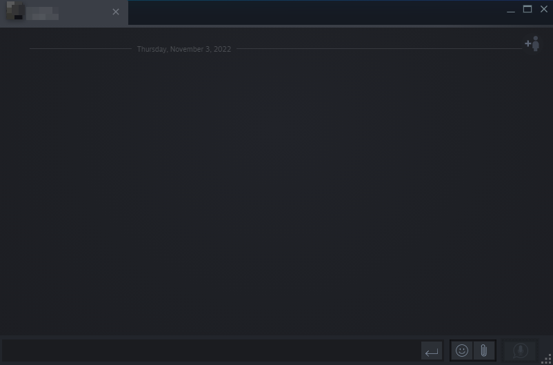

# Theme modification for bloated steam UI

# Credits for the library compact theme: [Jonius7](https://www.youtube.com/user/jhgenius)

## Instructions

1. Go to [PhantomGamers repository](https://github.com/PhantomGamers/SFP/releases/latest) download it and follow the instructions
2. Copy steamui & clientui to root directory of steam
3. Restart or press F5 to refresh the library to see the changes 

### PREVIEWS

#### CHAT

#### FRIEND LIST

#### LIBRARY

